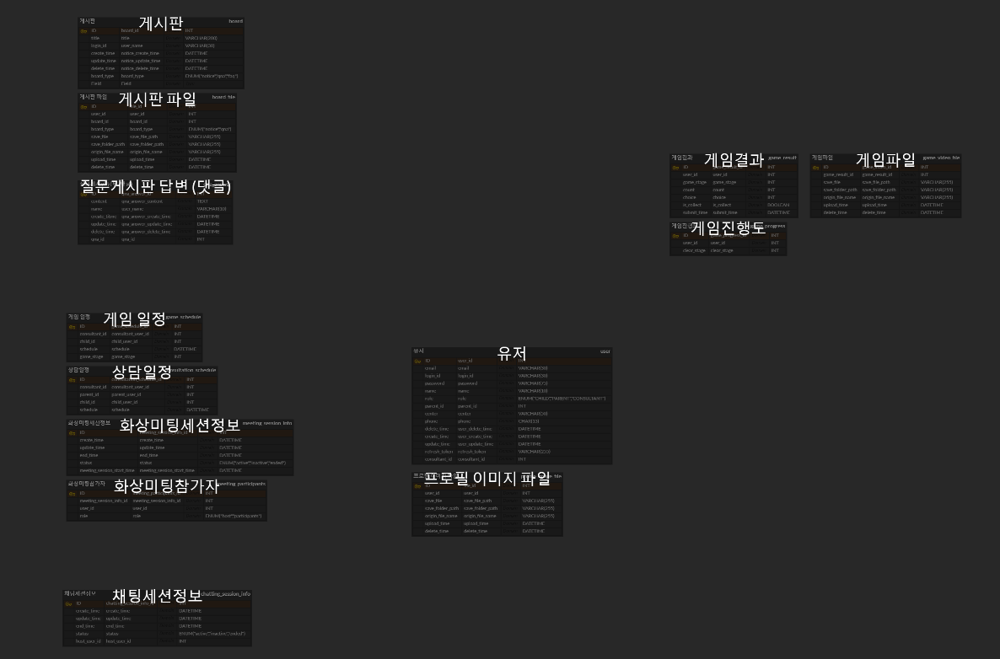
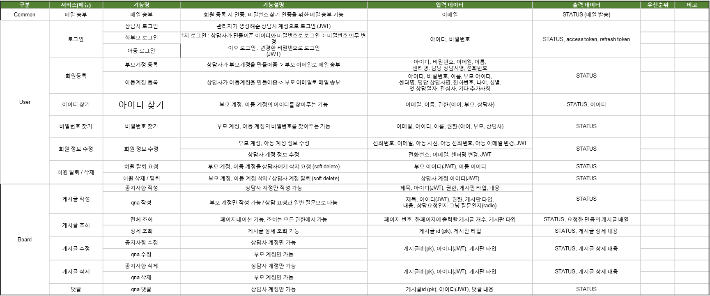
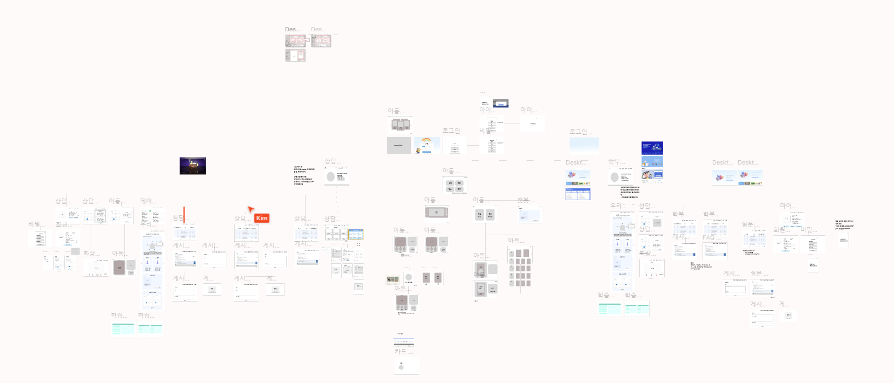
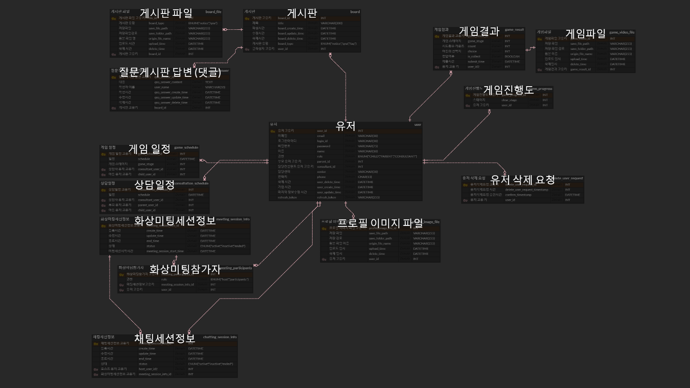
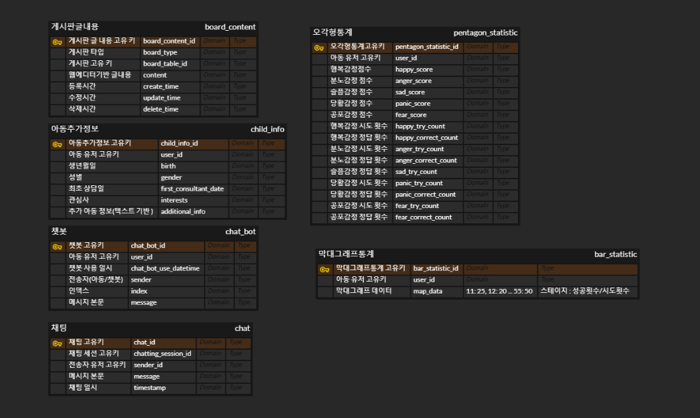
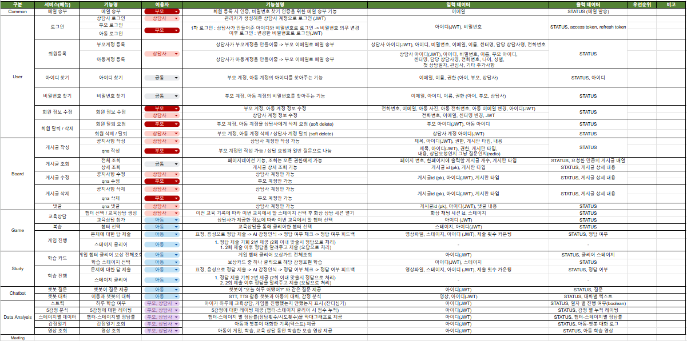

## 2025-01-13

프로젝트 개요 및 진행 상황

## 1. 초안

### 1.1 프로젝트 목표 및 배경

- **목적**: 자폐스펙트럼 아동의 삶의 질 향상 및 사회성 발달 증진
- **문제상황**:
  - 자폐스펙트럼 아동은 감정 표현 및 상호작용에 어려움
  - 맞춤형 상호작용 기술 부족 & 비용 부담 큼
- **서비스 장점**:
  - 집에서 학습 및 치료 가능 (비용 효율적)
  - 데이터 기반 피드백 및 맞춤형 상호작용 제공

### 1.2 주요 기능

1. **감정 분석 및 데이터 제공**
   - 실시간 얼굴 표정 및 제스처 인식
   - 학습 진척도 보고서, 분석 데이터 제공
2. **실시간 전문가 상담**
   - 화상통화 기능 & AI 분석 데이터 기반 상담
3. **몰입형 스토리 기반 학습 게임**
   - 단계별 감정 표현 미션 & AI 피드백
4. **교육 프로그램**
   - 감정 표현 학습 및 맞춤형 난이도 조정
5. **챗봇 기반 실시간 대화**
   - 아동과의 자연스러운 대화 & 부모를 위한 문제 해결 도구
6. **맞춤형 데이터 관리**
   - 발달 속도 분석, 반복 학습 추천
7. **기술 활용**
   - WebRTC & AI를 통한 실시간 얼굴 표정 인식
   - 게임화된 보상 시스템
8. **소셜 연계**
   - 부모 커뮤니티, 전문가 조언 공유

### 1.3 기대 효과

- 자폐아동의 감정 인지 및 표현 능력 향상
- 부모와 전문가의 부담 감소
- 사회적 가치 창출 (경제적 부담 완화)

### 1.4 보완 제안

1. **AI 공정성 확보** (데이터셋 검증 필요)
2. **UX/UI 설계** (자폐아동 & 부모 모두 사용하기 편리하게)
3. **글로벌 확장성** (다국어 지원 및 현지화)

---

## 2. 회의 후 결정사항

### 2.1 회원(계정) 관리

- **회원 기능**: 로그인/로그아웃, 계정 등록, 정보 조회/변경, 비밀번호 찾기 & 변경, 계정 삭제 요청
- **부모 계정 정보**
  - 이름, 핸드폰번호, 이메일, 내 자녀, 상담사 정보, 상담 기관 정보 등
- **상담사 계정 정보**
  - 이름, 핸드폰번호, 이메일, 소속기관명 등

### 2.2 학습 / 게임

1. **학습**
   - 감정 총 30가지
   - 이모지/텍스트 제시 → 아동이 표정과 목소리로 감정을 표현 → AI 인식
   - 문제 정보(성공 여부, 녹화 데이터 등) 전송
2. **게임**
   - 총 챕터 6개, 각 스테이지별로 다양한 상황 제시
   - 표정 및 목소리로 해당 감정을 표현 (선택지, 정답 처리 등)
   - 보상(학습 카드) 제공 및 스테이지 데이터 저장

### 2.3 학습 결과 제공 / 1대1 상담

- **학습**
  - 매일 학습 진척도, 정답률 그래프, 감정별 정답률
  - 문제별 시도 횟수 및 걸린 시간, 표정/목소리 데이터
- **게임**
  - 스테이지별 시도 횟수, 정답/오답 및 표정/목소리 데이터
- **1대1 화상 상담**
  - 일정(달력) 표시, 마이크/볼륨/화면공유 기능

### 2.4 1대다 화상 컨퍼런스

- 화면공유(강사용), 채팅, 마이크/볼륨 조절 기능

### 2.5 게시판

- **FAQ**, **상담 관련 질문 게시판**, **공지 게시판**
- 부모계정은 조회만 가능(상담 질문 게시판은 CRUD)
- 조회수, 작성자, 제목, 내용, 첨부파일 등

### 2.6 상담사용(전문가용) 업무

- 담당 아동 목록 (기본 정보 및 학습 데이터 조회, 상담 일정 예약)
- 계정 등록/삭제 (부모, 아이)
- 게시판 작성/수정/삭제/조회
- 특강 1대다 화상 컨퍼런스 방 생성/제거

---

## 3. 추후 회의 예정

1. **AI 챗봇을 통한 자폐 스펙트럼 아동의 언어·감정 표현 학습 서비스 기획**
2. **서비스 신뢰도 향상**을 위해 자문기관 조사 및 컨택 후 자문 요청
3. **화면설계서 작성** 후 상세 기능 명세 → ERD 설계 → 프론트·백엔드 데이터 구조 논의
4. 화상회의 컨퍼런스 기능보다는 **AI 챗봇을 통한 아동 학습 서비스 개발의 우선순위**를 높이는 것으로 합의

---

## 2025-01-14

프로젝트 기획 Develop

# 프로젝트 회의 결과 (2025-01-14)

## 1. 게임 기능

- **시도 횟수 제한**: 정답을 계속 시도하는 방식은 제외. 정답을 알려주고 3번 정도 반복 후에 다음 스테이지로 넘어감.
- **정답 처리 기준**:
  - 1~2번째 시도에서 정답을 맞추면 성공 처리
  - 3번째 시도에서 맞추면 오답 처리
- **보상 시스템**: 스테이지를 틀리거나 맞추더라도 동일하게 보상 제공

## 2. 챗봇 기능

- **아이 음성 데이터 활용**: 아이의 음성을 사용하여 모델 테스트 진행
- **감정 일기**:
  - 챗봇이 질문을 던지고 아이가 대답
  - 아이의 대답을 텍스트로 변환 후 감정 분석
- **보상 시스템**:
  - 하루에 하나씩 보상 제공, 보상을 모두 모으면 최종 보상 지급
  - 최종 보상을 받으면 다시 보상 수집 시작
  - **보상 예시**:
    - 퍼즐 조각 모으기
    - 포도알 하나씩 모아서 포도 완성하기

## 3. 아동 추가 정보

- **개인 정보**:
  - 아이 사진
  - 성별
  - 나이
  - 치료 기간 (드롭다운 선택)
  - 센터 첫 상담 날짜 (날짜 선택)
  - 관심사 (텍스트 입력)
  - 부모님 성함
  - 기타사항 (텍스트 입력)

## 4. 게임 및 학습 통계

- **게임 통계**:

  - 전체 그래프: 어떤 감정 문제를 맞췄는지 시각화
  - 5각형 그래프: 누적 통계 분석
  - 모든 문제에 대한 영상 및 음성 데이터 저장
  - 각 문제별 시도 횟수 및 성공 시도 차수 기록
  - 잔디 심기: 매일 학습 여부 시각화

- **챗봇 통계**:
  - 감정 일기 텍스트 데이터 저장

## 5. 자문기관 조사

- 각 팀원은 내일까지 자문기관 10곳 조사하여 공유 예정

---

## 2025-01-15

화면설계서 작성, ERD 작성

### 1. **진행 사항**

- **화면설계서**와 **ERD**가 대략적으로 완성됨.
- 내일 오전까지 화면설계서와 ERD를 최종적으로 완성 예정.
- **컨설턴트님**과의 미팅을 통해 부족한 부분을 보완 후 완벽하게 작성할 계획.
- 화면설계서 및 ERD를 참고하여 **요구사항 명세서** 작성 중.

### 2. **향후 계획**

- **1월 16일(목) 오전**까지 화면설계서 및 ERD 최종 완성.
- 컨설턴트 미팅 후 피드백 반영 및 보완.
- **요구사항 명세서** 작성 마무리 및 검토.

### 3. **첨부 자료**

- 화면설계서 대략적인 내용
  

- ERD 대략적인 내용 (외래키 적용 완료)
  

- 요구사항 명세서 작성 중인 내용
  

---

## 2025-01-16

프로젝트 기획 진행사항

### 1. **진행 사항**

- **화면설계서**와 **ERD** 초안 완성
  
  
  
- **화면설계서**와 **ERD** 초안 비교 점검
- 화면(UI)에 필요한 데이터와 DB 구조 간의 연계성을 확인하고, 누락되거나 불필요한 기능 및 데이터 요소를 식별하여 수정 및 보완 작업 진행
- **컨설턴트님**과의 미팅을 통해 ERD에 대한 피드백을 받고 구조적인 최적화 진행 예정.
- 화면설계서 및 ERD를 참고하여 **요구사항 명세서** 작성 중 (50% 완료).

### 2. **향후 계획**

- 1월 16일(금)까지 **페이지 디자인** 완성.
- 컨설턴트 미팅 후 **ERD 최적화 및 완성**.
- **요구사항 명세서** 작성 마무리
  

### 3. **자문기관 컨택**

- 대략 60여개의 자폐 스펙트럼 장애와 연관된 **협회, 병원, 센터 등 조사 완료**.
- 디자인 초안과 요구사항 명세서 초안 작성 후 **모든 기관 컨택 예정**.
- 기관의 담당자 연락처, 이메일 조사 후 **프로젝트 내용에 대한 소개**를 통해 **실질적인 도움**이 될 수 있는지 확인할 예정.
- 기관의 자문을 통해서 **더욱 완성도 있는 프로젝트를 기획**하여 개발에 들어갈 예정.

---
