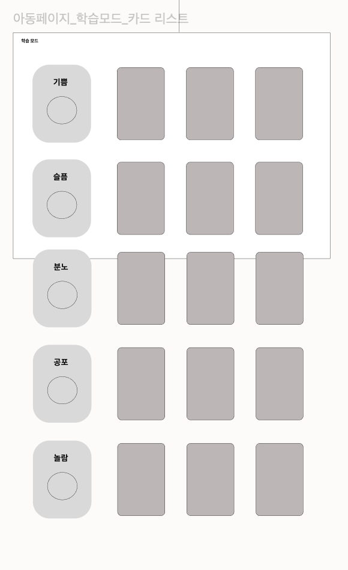

# 1주차

## 기획 주간

<details>
<summary>2025-01-13</summary>

### 📘 학습한 내용

- Three.js 설치 방법(NPM 및 CDN 사용법)
- Three.js의 핵심 구성 및 요소 이해
  - 장면 : scene, 3D 장면의 기본 컨테이너.
  - 객체 : mesh, 장면에 배치되는 3D 객체(기하학적 형태 + 재질).
  - 카메라 : camera, 3D 장면을 보는 시점.
  - 렌더러 : renderer, HTML의 Canvas 요소에 3D 장면을 렌더링.
  - WebGL : 웹 브라우저에서 플러그인 없이 3D 그래픽을 구현할 수 있도록 도와주는 javascript API.

---

### 🛠️ 오늘 한 작업

- 아동 학습 페이지 프로토타입 제작
  - 자폐성 장애 아동을 위한 학습 페이지를 Three.js를 사용하여 3D로 구현
  - 메인 페이지를 피그마를 사용하여 홈페이지 초안 구현
- 자폐성 장애 아동 관련 협회 및 센터 조사
  - 국내 주요 자폐성 장애 지원 기괌 및 협회 목록 작성

---

### 📝 추가 메모

- 아동 챗봇 관련 추가 자료조사 필요
</details>

<details>
<summary>2025-01-14</summary>

### 📘 학습한 내용

- Figma 스크롤의 구성
- 스크롤은 컨테이너의 크기와 콘텐츠의 크기롤 구성되어있다.
- 스크롤은 콘텐츠가 담고 있는 컨테이너(프레임)의 크기보다 안에 담겨 있는 콘텐츠의 크기가 더 클때 실행이 가능하다.
- 스크롤의 종료는 prototype으로 확인이 가능하다.

```
스크롤의 종류
  - Horizontal(가로)
  - vertical(세로)
  - Horizontal and Vertical(가로 세로 모두)
```

## 

### 🛠️ 오늘 한 작업

- 피그마를 활용하여 화면설계서 초안 작성
  - 학부모 및 상담사의 데이터 분석 페이지 구성
    - 일별 영상 데이터
    - 아동 학습 분석 차트
  - 아동 페이지 전체 구성
    - 게임형 학습 인터페이스 설계
    - 보상 시스템(카드) 구현 화면
  - 학부모, 상담사 메인페이지 구성
- 자폐성 장애 아동 관련 협회 및 센터 조사
  - 공공데이터를 활용하여 전국에 아동 자폐 스펙트럼 관련 치료 협회 조사
  - 치료 기관 리스트 작성
- 자폐성 장애 아동 영상데이터 자료 조사
  - 상호작용 및 영상 표현 관련 영상

---

### 📝 추가 메모

- 이번주에 배운 피그마와 three.js를 활용하여 화면설계도 구성 완수하기
  - 아동 페이지 : three.js 활용
- 치료 기관 리스트에 보낼 자문 초안 작성하기
  - 자문 요청 목적 및 범위 정리
  - 필요한 데이터 항목 리스트 작성
  - 아동 치료 관련 전문적 조언 요청 사항 정리
  </details>

<details>
<summary>2025-01-15</summary>

### 📘 학습한 내용

#### 피그마 프로토타입

- 피그마 프로토타입은 디자이너가 설계한 화면을 실제로 작동하는 것처럼 시뮬레이션할 수 있는 기능.
- 이를 통해 화면 간의 연결을 설정하고, 사용자가 버튼을 클릭하거나 특정 동작을 했을 때 어떤 화면으로 이동하는지를 시각적으로 표현
- 프로토타입을 사용하면 사용자 흐름을 테스트하고, 디자인이 사용자 경험(UX)에 적합한지 미리 확인

---

#### 주요 기능

1. **화면 간 이동 구현**

   - 클릭 가능한 링크를 통해 화면 간 이동 경로 설정
   - 사용자 흐름을 시뮬레이션 가능

2. **실시간 협업**

   - 디자이너와 개발자 간 실시간 작업 공유 및 협업

3. **프로토타입 제작의 중요성**
   - 사용자 경험(UX) 테스트
   - 빠른 피드백 및 수정 가능
   - 개발 전 디자인 검증

---


#### 피그마에서 프로토타입 제작 방법

1. 화면을 디자인한 후, 연결 도구를 사용해 화면 간 이동 경로를 설정
2. 애니메이션 효과(예: 슬라이드, 페이드)를 추가
3. 미리보기 기능을 활용하거나 공유 링크를 생성해 팀원과 작업을 검토

---

### 🛠️ 오늘 한 작업

#### 화면설계도, 정보구조도 수정 및 구체화

#### **대표적인 수정**

1. **전반적인 데이터 구조 변경**

   - 비밀번호 변경 및 찾기 기능에 회원 유형 선택 옵션 추가
   - 카드 페이지와 수토리 페이지 구성 방식 수정
   - 학습 페이지 하위에 **카드리스트**와 **복습 모드** 추가
   - 상담사의 예약 기능(CRUD) 수정 및 예약 관리 기능 강화

2. **질문 게시판 분류 및 추가**

   - 게시판 사용성을 개선하기 위해 **공지사항**, **FAQ**, **질문/상담** 세 가지 분류를 추가 설계
   - 질문 주제별 분류 및 검색 기능 설계
   - 전문가 답변 기능 유지 및 사용자 편의성 개선

3. **게임 내 화상 연결 화면 설계**
   - 게임 화면 실시간 공유 기능 설계
   - 상담사 입장 루트를 간소화하고 사용자 흐름 최적화
   - 화상 연결 중 텍스트 채팅 기능 추가

---

### 📝 추가 메모

- 디자인 조사가 필요
  - 사용자 UI, UX 설계의 최신 트렌드를 반영하기 위해 추가적인 디자인 조사가 필요
- 협업 중 느낀 점
  - 디자인 디테일을 먼저 논의할지, 전체적인 구조를 먼저 개발할지에 대한 접근 방식이 달랐음
  - 우선순위와 작업 방식을 미리 논의해 합의를 이루는 것이 중요하다는 것을 느낌
    - 각자 선호하는 작업 방식을 고수할 때 발생할 수 있는 갈등을 예방하기 위해, 프로젝트 시작 전에 전체적인 흐름과 우선순위를 명확히 정리하는 것이 중요하다는 것을 깨달음

</details>

<details>
<summary>2025-01-16</summary>

### 🛠️ 오늘 한 작업

1. 학부모, 상담사 메인페이지, 아이 데이터 페이지 수정

- 기존 레이아웃 및 UI 개선
- 주요 정보 표시 방식 최적화

2. 챗봇 기능 페이지 추가

- 질문 응답 기능 설계
- 기본 대화 흐름 구조 작성

3. 게임 스토리 확정

- 아이의 관심과 상호작용을 끌어내기 위한 스토리 설계
- 레벨 구조 개발

4. 수정된 화면설계서를 보고 정보구조도 수정

- 추가된 페이지에 대한 데이터 흐름 수정
  
  
  

---

### 📝 추가 메모

- 프로토타입 + 디자인 하기

  - 전체 UI/UX 시뮬레이션 테스트
  - 컬러 팔레트와 주요 컴포넌트 스타일링 확정하기

- 기획 초안 과정에서 세심하게 점검하지 못해 작업을 몇 차례 반복하는 일이 있었습니다. 이를 계기로 처음부터 더 철저히 준비하는 자세의 중요성을 느꼈습니다.

</details>
