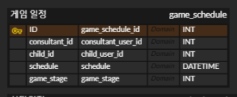

<details>
<summary> 25.01.13 </summary>

## ERD 초안 테이블 구조 작성

### 정규 데이터


```sql
-- 사용자 정보를 저장하는 테이블
CREATE TABLE `user` (
	`user_id`	INT	NOT NULL, -- 고유 아이디
	`email`	VARCHAR(255)	NOT NULL, -- 이메일 주소
	`password`	VARCHAR(25)	NOT NULL, -- 비밀번호
	`name`	VARCHAR(30)	NOT NULL, -- 사용자 이름
	`age`	INT	NOT NULL, -- 나이
	`role`	ENUM("CHILD","PARENT","CONSULTANT")	NOT NULL, -- 사용자 역할 (아동, 보호자, 상담사)
    `parent_id` INT NULL, --아동의 보호자가 있는 경우 연결 위함
	`center`	VARCHAR(45)	NOT NULL, -- 센터 정보
	`phone`	VARCHAR(15)	NOT NULL, -- 전화번호
	`user_delete_time`	DATETIME	NULL, -- 사용자 삭제 시간
	`user_create_time`	DATETIME	NULL, -- 사용자 생성 시간
	`user_update_time`	DATETIME	NULL, -- 사용자 수정 시간
	`refresh_token`	VARCHAR(500)	NULL, -- 리프레시 토큰
	`login_id`	VARCHAR(30)	NULL -- 로그인 아이디
);

-- 공지사항 정보를 저장하는 테이블
CREATE TABLE `notice` (
	`notice_id`	INT	NOT NULL, -- 공지사항 ID
	`notice_title`	VARCHAR(255)	NOT NULL, -- 공지사항 제목
	`user_name`	VARCHAR(30)	NOT NULL, -- 작성자 이름
	`notice_create_time`	DATETIME	NULL, -- 공지사항 생성 시간
	`notice_update_time`	DATETIME	NULL, -- 공지사항 수정 시간
	`notice_delete_time`	DATETIME	NULL -- 공지사항 삭제 시간
);

-- 질문 및 답변(QnA)을 저장하는 테이블
CREATE TABLE `qna` (
	`qna_id`	INT	NOT NULL, -- 질문 ID
	`qna_title`	VARCHAR(255)	NOT NULL, -- 질문 제목
	`user_name`	VARCHAR(30)	NOT NULL, -- 작성자 이름
	`qna_create_time`	DATETIME	NULL, -- 질문 생성 시간
	`qna_update_time`	DATETIME	NULL, -- 질문 수정 시간
	`qna_delete_time`	DATETIME	NULL -- 질문 삭제 시간
);

-- 질문에 대한 답변을 저장하는 테이블
CREATE TABLE `qna_answer` (
	`qna_answer_id`	INT	NOT NULL, -- 답변 ID
	`qna_answer_content`	TEXT	NOT NULL, -- 답변 내용
	`user_name`	VARCHAR(30)	NOT NULL, -- 답변 작성자 이름
	`qna_answer_create_time`	DATETIME	NULL, -- 답변 생성 시간
	`qna_answer_update_time`	DATETIME	NULL, -- 답변 수정 시간
	`qna_answer_delete_time`	DATETIME	NULL, -- 답변 삭제 시간
	`qna_id`	INT	NOT NULL -- 연관된 질문 ID
);

-- 게임 진행 정보를 저장하는 테이블
CREATE TABLE `game_progress` (
	`game_progress_id`	INT	NOT NULL, -- 게임 진행 ID
	`user_id`	INT	NOT NULL, -- 사용자 ID
	`clear_stage`	INT	NULL, -- 클리어한 스테이지
	`clear_date`	DATETIME	NULL -- 클리어 날짜
);

-- 상담 일정을 저장하는 테이블
CREATE TABLE `consultation_schedule` (
	`consultation_schedule_id`	INT	NOT NULL, -- 상담 일정 ID
	`consultant_user_id`	INT	NOT NULL, -- 상담사 사용자 ID
	`parent_user_id`	INT	NOT NULL, -- 부모 사용자 ID
	`child_user_id`	INT	NOT NULL, -- 자녀 사용자 ID
	`schedule`	DATETIME	NOT NULL -- 상담 일정 시간
);

-- 게임 결과를 저장하는 테이블
CREATE TABLE `game_result` (
	`game_result_id`	INT	NOT NULL, -- 게임 결과 ID
	`user_id`	INT	NOT NULL, -- 사용자 ID
	`game_stage`	INT	NOT NULL, -- 게임 스테이지 번호
	`choice`	INT	NOT NULL, -- 사용자 선택
	`is_collect`	BOOLEAN	NOT NULL, -- 정답 여부
	`submit_time`	DATETIME	DEFAULT NOW() -- 제출 시간
);

-- 학습 결과를 저장하는 테이블
CREATE TABLE `study_result` (
	`game_result_id`	INT	NOT NULL, -- 학습 결과 ID
	`user_id`	INT	NOT NULL, -- 사용자 ID
	`study_stage`	INT	NOT NULL, -- 학습 스테이지 번호
	`choice`	INT	NOT NULL, -- 사용자 선택
	`is_collect`	BOOLEAN	NOT NULL, -- 정답 여부
	`submit_time`	DATETIME	NULL    DEFAULT NOW() -- 제출 시간
);

-- 화상회의 세션 정보를 저장하는 테이블
CREATE TABLE `meeting_session_info` (
	`meeting_session_info_id`	INT	NOT NULL, -- 세션 정보 ID
	`session_name`	VARCHAR(50)	NOT NULL, -- 세션 이름
	`create_time`	DATETIME	NULL DEFAULT NOW(), -- 생성 시간
	`update_time`	DATETIME	NULL, -- 업데이트 시간
	`end_time`	DATETIME	NULL, -- 종료 시간
	`status`	ENUM("active","inactive","ended")	DEFAULT "inactive" -- 세션 상태
);

-- 화상회의 참가자 정보를 저장하는 테이블
CREATE TABLE `meeting_participants` (
	`meeting_participants_id`	INT	NOT NULL, -- 참가자 정보 ID
	`meeting_session_info_id`	INT	NOT NULL, -- 세션 정보 ID
	`user_id`	INT	NOT NULL, -- 사용자 ID
	`role`	ENUM("host","participants")	DEFAULT "participants" -- 역할 (호스트/참가자)
);

-- 파일 업로드 정보를 저장하는 테이블
CREATE TABLE `file` (
	`file_id`	INT	NOT NULL, -- 파일 ID
	`user_id`	INT	NOT NULL, -- 업로드한 사용자 ID
	`save_file_path`	VARCHAR(255)	NOT NULL, -- 저장된 파일 경로
	`save_folder_path`	VARCHAR(255)	NOT NULL, -- 저장된 폴더 경로
	`origin_file_name`	VARCHAR(255)	NOT NULL, -- 원본 파일 이름
	`file_type`	ENUM("picture","video","voice")	NOT NULL, -- 파일 유형
	`upload_time`	DATETIME	DEFAULT NOW(), -- 업로드 시간
	`delete_time`	DATETIME	NULL -- 삭제 시간
);

-- 자주 묻는 질문(FAQ)을 저장하는 테이블
CREATE TABLE `faq` (
	`qna_id`	INT	NOT NULL, -- 질문 ID
	`faq_title`	VARCHAR(255)	NOT NULL, -- FAQ 제목
	`user_name`	VARCHAR(30)	NOT NULL, -- 작성자 이름
	`faq_create_time`	DATETIME	DEFAULT NOW(), -- FAQ 생성 시간
	`faq_update_time`	DATETIME	NULL, -- FAQ 수정 시간
	`faq_delete_time`	DATETIME	NULL -- FAQ 삭제 시간
);

-- 채팅 세션 정보를 저장하는 테이블
CREATE TABLE `chatting_session_info` (
	`chatting_session_info_id`	INT	NOT NULL, -- 채팅 세션 ID
	`create_time`	DATETIME	DEFAULT NOW(), -- 생성 시간
	`update_time`	DATETIME	NULL, -- 업데이트 시간
	`end_time`	DATETIME	NULL, -- 종료 시간
	`status`	ENUM("active","inactive","ended")	DEFAULT "inactive", -- 세션 상태
	`host_user_id`	INT	NOT NULL -- 호스트 사용자 ID
);

```


### 비정규 데이터 

- 웹에디터를 이용한 글 내용
- 아동 추가 정보
- 채팅
- 게임 통계
- 학습 통계
- 게임 에셋
- 학습 에셋


## MongoDB 명령어 정리

### **컬렉션(Collection)이란?**
MongoDB에서 컬렉션(Collection)은 RDBMS(관계형 데이터베이스)의 테이블(Table)과 비슷한 개념으로, 여러 문서(Document)를 모아놓은 그룹입니다.

---

### **컬렉션의 특징**
1. **스키마가 유연함**: 컬렉션에 저장된 문서들은 같은 구조를 가질 필요가 없습니다. 다양한 형태의 문서를 저장할 수 있습니다.
   ```javascript
   // 문서 1
   {
     "name": "Alice",
     "age": 25
   }

   // 문서 2
   {
     "name": "Bob",
     "email": "bob@example.com",
     "verified": true
   }
   ```

2. **RDBMS 테이블과 차이점**:
   - 컬렉션은 행(Row) 대신 **문서(Document)**를 저장합니다.
   - 문서는 JSON과 유사한 **BSON**(Binary JSON) 형태로 저장됩니다.
   - 컬렉션의 각 문서에는 고유한 필드 **_id**가 기본적으로 존재합니다.

3. **컬렉션 생성 방법**:
   ```javascript
   use myDatabase  // 데이터베이스 선택
   db.users.insertOne({ name: "Alice", age: 25 })  // users 컬렉션 자동 생성
   ```
   - 명시적으로 컬렉션 생성:
     ```javascript
     db.createCollection("myCollection")
     ```

---

### **컬렉션과 문서 관계 예시**
**데이터베이스**: travelDB  
**컬렉션**: destinations  
**문서**:
```javascript
{
  "destination": "Seoul",
  "country": "South Korea",
  "popularSpots": ["Namsan Tower", "Gyeongbokgung Palace"],
  "rating": 4.8
}
```

---

## **MongoDB CRUD 및 관리 명령어**

### **1. 데이터베이스 및 컬렉션 관리 명령어**
- **데이터베이스 조회**:
  ```bash
  show dbs
  ```
- **데이터베이스 선택 또는 생성**:
  ```bash
  use <데이터베이스명>
  ```
- **컬렉션 목록 보기**:
  ```bash
  show collections
  ```
- **컬렉션 삭제**:
  ```javascript
  db.<컬렉션명>.drop()
  ```
- **데이터베이스 삭제**:
  ```javascript
  db.dropDatabase()
  ```

---

### **2. 데이터 삽입 (Create)**
- **단일 데이터 삽입**:
  ```javascript
  db.<컬렉션명>.insertOne({ <key>: <value>, ... })
  ```
  예시:
  ```javascript
  db.users.insertOne({ name: "Alice", age: 25, city: "Seoul" })
  ```

- **다중 데이터 삽입**:
  ```javascript
  db.<컬렉션명>.insertMany([{ <key>: <value>, ... }, ... ])
  ```
  예시:
  ```javascript
  db.users.insertMany([
    { name: "Bob", age: 30, city: "Busan" },
    { name: "Charlie", age: 28, city: "Daegu" }
  ])
  ```

---

### **3. 데이터 조회 (Read)**
- **모든 데이터 조회**:
  ```javascript
  db.<컬렉션명>.find()
  ```
- **조건부 데이터 조회**:
  ```javascript
  db.<컬렉션명>.find({ <조건>: <값> })
  ```
  예시:
  ```javascript
  db.users.find({ city: "Seoul" })
  ```
- **정렬된 데이터 조회**:
  ```javascript
  db.<컬렉션명>.find().sort({ <필드명>: 1 })  // 1: 오름차순, -1: 내림차순
  ```
  예시:
  ```javascript
  db.users.find().sort({ age: -1 })
  ```
- **특정 필드만 조회**:
  ```javascript
  db.<컬렉션명>.find({}, { <필드명>: 1, <필드명>: 0 })
  ```
  예시:
  ```javascript
  db.users.find({}, { name: 1, _id: 0 })
  ```

---

### **4. 데이터 수정 (Update)**
- **단일 데이터 업데이트**:
  ```javascript
  db.<컬렉션명>.updateOne(
    { <조건>: <값> },
    { $set: { <수정할 필드>: <값> } }
  )
  ```
  예시:
  ```javascript
  db.users.updateOne(
    { name: "Alice" },
    { $set: { age: 26 } }
  )
  ```

- **다중 데이터 업데이트**:
  ```javascript
  db.<컬렉션명>.updateMany(
    { <조건>: <값> },
    { $set: { <수정할 필드>: <값> } }
  )
  ```
  예시:
  ```javascript
  db.users.updateMany(
    { city: "Seoul" },
    { $set: { verified: true } }
  )
  ```

---

### **5. 데이터 삭제 (Delete)**
- **단일 데이터 삭제**:
  ```javascript
  db.<컬렉션명>.deleteOne({ <조건>: <값> })
  ```
  예시:
  ```javascript
  db.users.deleteOne({ name: "Charlie" })
  ```

- **다중 데이터 삭제**:
  ```javascript
  db.<컬렉션명>.deleteMany({ <조건>: <값> })
  ```
  예시:
  ```javascript
  db.users.deleteMany({ city: "Busan" })
  ```

---

### **6. 기타 명령어**
- **컬렉션 내 데이터 개수 조회**:
  ```javascript
  db.<컬렉션명>.countDocuments()
  ```
  예시:
  ```javascript
  db.users.countDocuments()
  ```

- **인덱스 생성**:
  ```javascript
  db.<컬렉션명>.createIndex({ <필드명>: 1 })
  ```
  예시:
  ```javascript
  db.users.createIndex({ name: 1 })
  ```

- **인덱스 조회**:
  ```javascript
  db.<컬렉션명>.getIndexes()
  ```

---
</details>

---

<details>
<summary> 25.01.14 </summary>

# ERD 초안 수정

## 기능 및 구조 변경으로 인한 수정

### 1. user table
login_id 컬럼 추가됨.
### 2. chatting_session_info table
host_user_id 컬럼: 새로 추가됨.
### 3. 비정규 데이터 컬렉션
{width=673 height=618}
- 웹에디터를 이용한 글 내용 구체화
- 아동 추가 정보 구체화
- 채팅 테이블 구체화
- 게임 통계 -> 오각형 그래프 통계 테이블로 변경
- 학습 통계 -> 오각형 그래프 통계 테이블로 변경
- 게임 에셋 -> 보류
- 학습 에셋 -> 보류
</details>

---

<details>
<summary> 25.01.15 </summary>

# ERD 초안 수정
## 기능 및 구조 변경, 기능 구체화로 인한 수정 주요 변경 사항

### 1. user table / child_info collection
- user table의 age 컬럼 child_info collection의 컬렉션 키로 변경
 
### 2. 프로필 이미지 파일 table 분리
{width=286 height=125}

### 3. 게시판 테이블 통합
{width=321 height=147}

### 4. 상담사가 아동의 게임을 확인하는 일정 테이블 추가


### 5. 정규 데이터 외래키 지정 (진행 중)


### 6. 비정규 데이터 컬렉션
- 게임 에셋 -> 삭제
- 학습 에셋 -> 삭제
게임 및 학습에 대한 관리를 프론트에서 진행함으로 인해 삭제

## 추가 진행 필요 사항

### 1. 계정 삭제 요청 테이블, 상담 요청 관련 테이블 추가 필요

### 2. 외래키 지정 마무리
</details>
