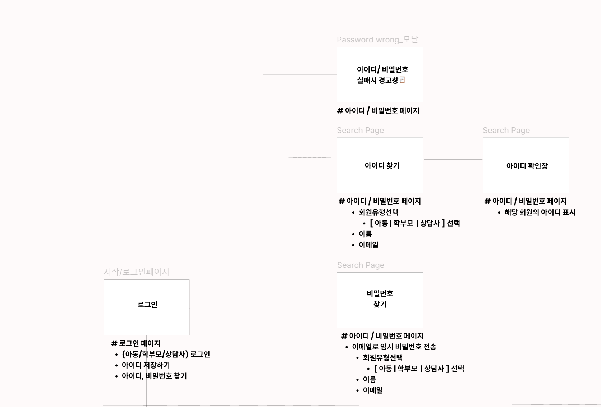
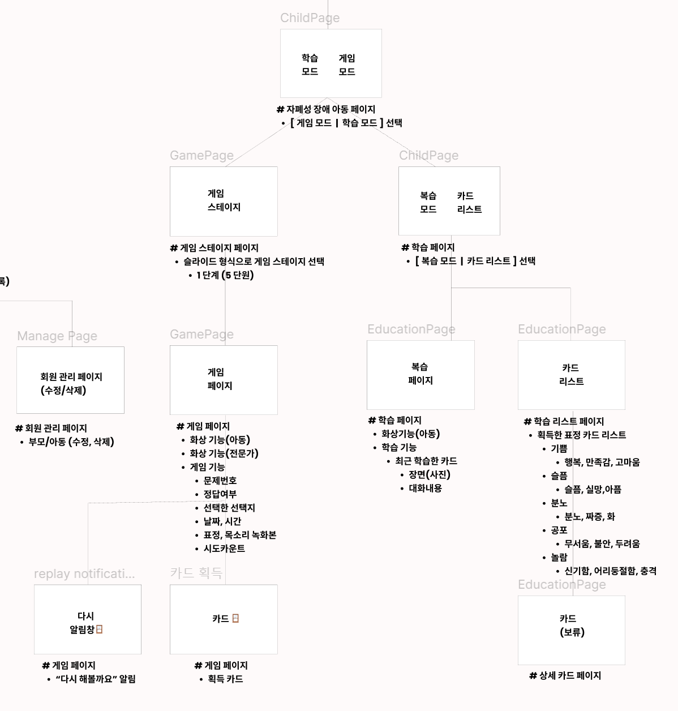
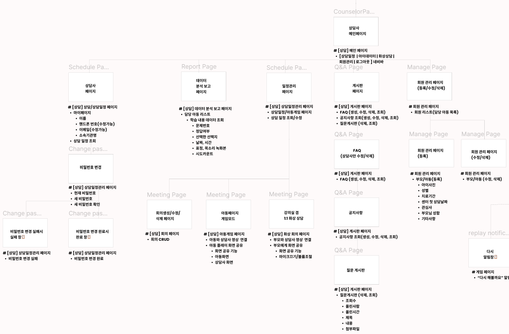
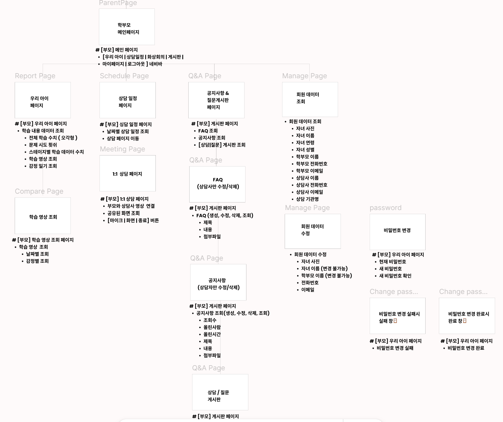
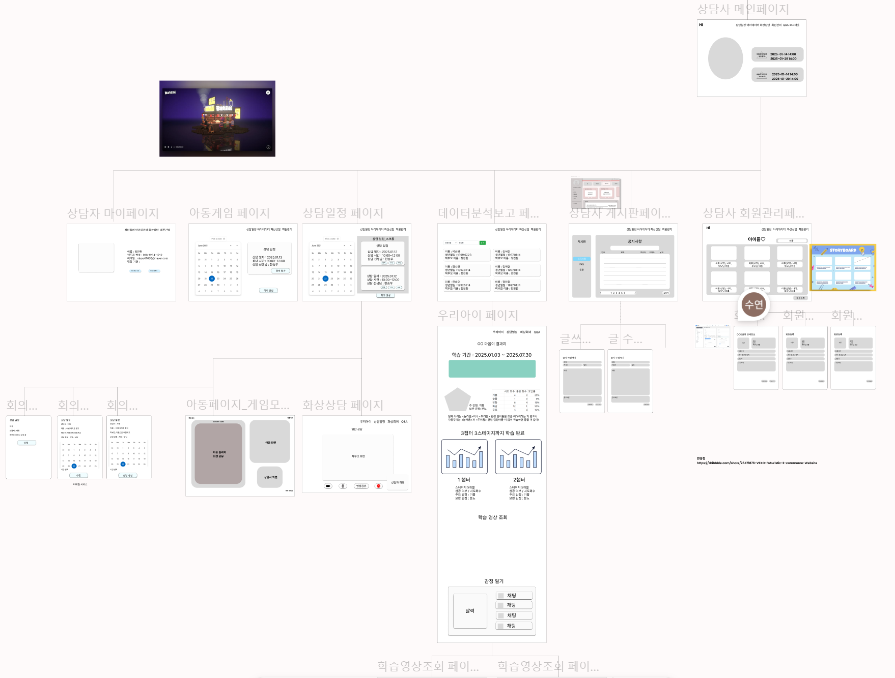
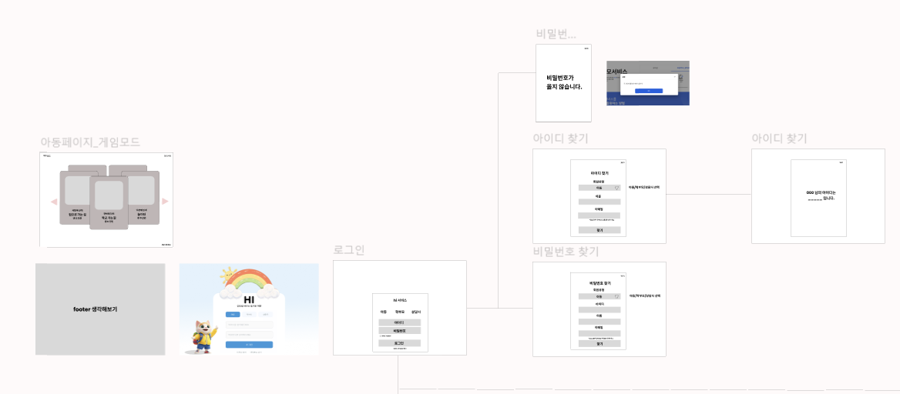
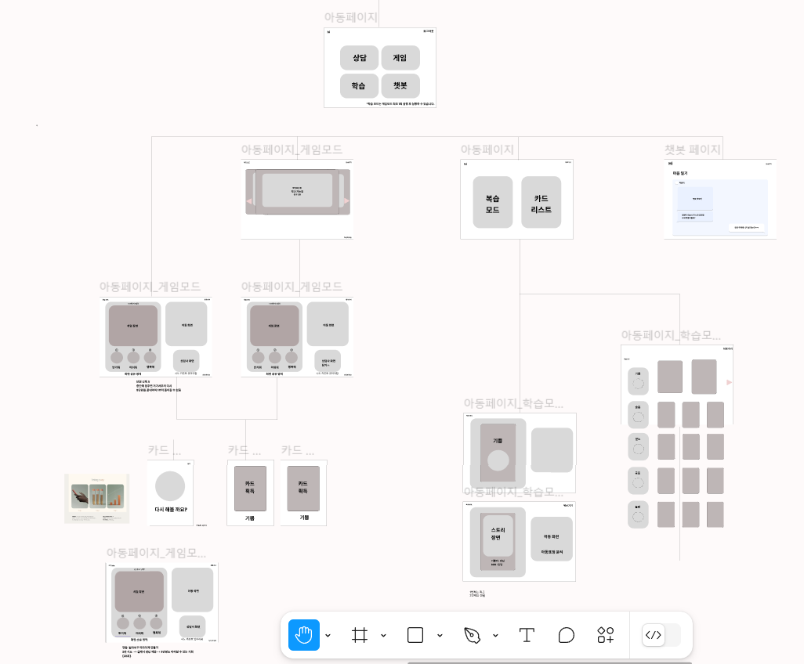
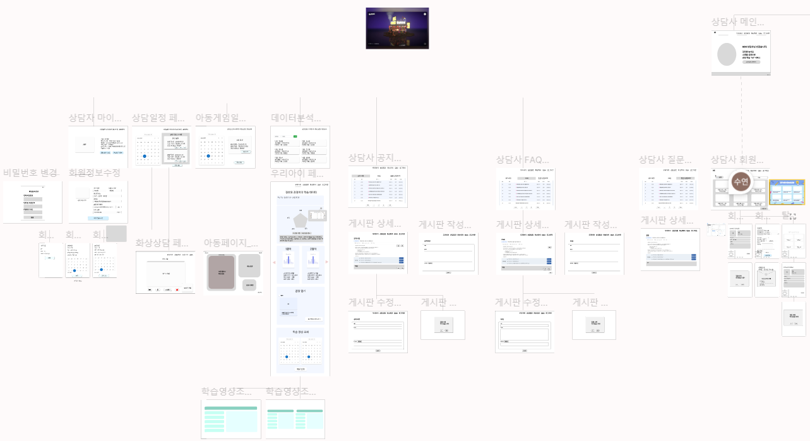
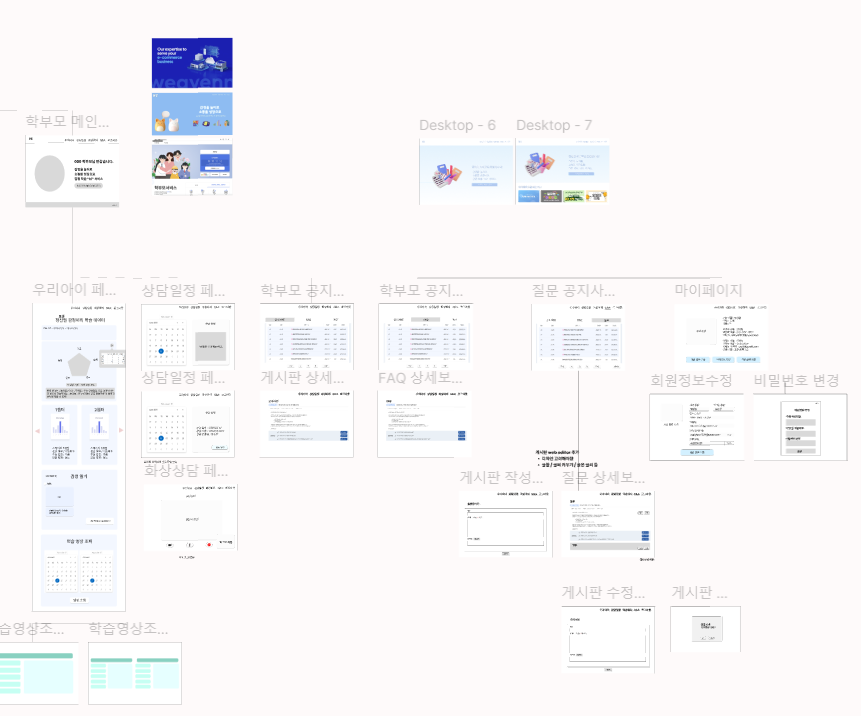

## 1주차 계획

<details>
<summary>2025-01-13</summary>

### 어떤 React 라이브러리 사용할지 조사하기
=> 아래 라이브러리 조사를 기반으로 디자인 설계 후 어떤 라이브러리가 적합할 지 결정할 예정!
1. 상태관리
    - 프로젝트의 규모와 복잡성을 고려하여 적절한 상태관리 방식을 선택하려고 하고, 진행하는 프로젝트가 상대적으로 작은 규모라고 생각하기 때문에 처음에는 React 내장 기능만으로 시작하고, 필요성이 생길 때 외부 라이브러리 도입하려고 생각
    - 종류
        1. Redux : 가장 널리 사용되는 상태 관련 라이브러리로 JS 애플리케이션의 상태관리를 위한 라이브러리
            - 장점 : 디버깅 쉬움, 예측 가능한 상태관리, 중앙 집중식 상태 관리
            - 단점 : 작은 프로젝트에서는 과도할 수 있음
            - 핵심개념
                ```
                // Store: 전체 애플리케이션의 상태를 보관
                const store = createStore(reducer);

                // Action: 상태 변경을 위한 객체
                const addTodoAction = {
                type: 'ADD_TODO',
                payload: '리액트 공부하기'
                };

                // Reducer: 상태를 변경하는 순수 함수
                const todoReducer = (state = [], action) => {
                switch (action.type) {
                    case 'ADD_TODO':
                    return [...state, action.payload];
                    default:
                    return state;
                }
                };
                ```
2. UI 컴포넌트
    - 종류
        1. TailwindCSS : 유틸리티 우선 방식의 CSS 프레임워크         
            - 미리 정의된 클래스들을 조합하여 스타일 구성하는 방식
            - 빠른 프로토타이핑과 일관된 디자인 시스템 구축에 매우 효과적 but, 처음에는 클래스가 많아 보일 수 있음
            - 장점 : 클래스명으로 직관적인 스타일링, 반응형 디자인 쉬움, 커스터마이징 자유로움, 번들 크기 최적화(사용한 클래스만 포함)
            - 핵심개념
                ```
                // 1. 레이아웃
                <div className="container mx-auto px-4">  // 중앙 정렬, 좌우 패딩
                <div className="flex items-center">       // Flexbox 중앙 정렬
                <div className="grid grid-cols-3 gap-4">  // 3열 그리드, 간격 설정

                // 2. 스페이싱
                <div className="m-4">        // margin: 1rem
                <div className="p-4">        // padding: 1rem
                <div className="space-y-4">  // 자식 요소들 사이 간격

                // 3. 크기 설정
                <div className="w-full">      // width: 100%
                <div className="h-screen">    // height: 100vh
                <div className="max-w-md">    // max-width 설정

                // 4. 색상
                <div className="bg-blue-500">  // 배경색
                <div className="text-gray-700"> // 텍스트 색상
                <div className="border-red-300"> // 테두리 색상

                // 5. 타이포그래피
                <p className="text-lg font-bold">  // 큰 글씨, 굵은 글씨
                <p className="text-center">        // 가운데 정렬
                <p className="truncate">           // 말줄임표

                // 6. 반응형 디자인
                <div className="md:flex lg:grid">  // 브레이크포인트별 레이아웃  
                ```
        2. Chakra UI : React를 위한 모던하고 접근성이 뛰어난 컴포넌트 라이브러리
            - 빠른 개발과 접근성 있는 UI구축에 매우 유용한 도구
            - 기본적으로 제공되는 컴포넌트들이 잘 만들어져 있어 별도의 스타일링 없이도 깔끔한 UI구현 가능
            - 장점 : 접근성 우수, 반응형 디자인 쉬움, 테마 커스터마이징 용이, Hook기반의 편리한 기능들, 다크 모드 지원
            - 사용예시
                ```
                // Flex 컨테이너
                <Flex direction="row" align="center" justify="space-between">
                <Box>Item 1</Box>
                <Box>Item 2</Box>
                </Flex>

                // Grid 레이아웃
                <Grid templateColumns="repeat(3, 1fr)" gap={6}>
                <GridItem>1</GridItem>
                <GridItem>2</GridItem>
                <GridItem>3</GridItem>
                </Grid>

                // Stack으로 간격 조절
                <VStack spacing={4} align="stretch">
                <Box>Item 1</Box>
                <Box>Item 2</Box>
                </VStack>
                ```
        3. Styled-components(CSS-in-JS)
            - 장점 : 동적 스타일링 용이, JS변수/props 사용 가능, 컴포넌트 단위 스타일링
            - 단점 : 번들 크기 증가, 러닝 커브 존재
            - 사용예시
                ```
                import styled from 'styled-components';

                const StyledButton = styled.button`
                background-color: ${props => props.primary ? 'blue' : 'gray'};
                color: white;
                padding: 10px 20px;
                `;

                function Button() {
                return <StyledButton primary>클릭</StyledButton>;
                }
                ```
3. 라우팅
    - React 애플리케이션에서 라우팅을 관리하는 라이브러리로 페이지간의 이동과 URL관리를 쉽게 할 수 있음
    - 종류
        1. React Router : 대부분 React 애플리케이션에서 필수적으로 사용되는 라이브러리이며, SPA 구축에 매우 유용
            - 장점 : 선언적 라우팅, 동적 라우트 매칭, 히스토리 관리, 중첩 라우팅 지원, 코드 스프리팅 지원, 다양한 라우팅 타입 제공  
            - 설정 및 사용법
                ```
                // App.js
                import { BrowserRouter, Routes, Route } from 'react-router-dom';

                function App() {
                return (
                    <BrowserRouter>
                    <Routes>
                        <Route path="/" element={<Home />} />
                        <Route path="/about" element={<About />} />
                        <Route path="/users/:id" element={<UserDetail />} />
                        <Route path="*" element={<NotFound />} />
                    </Routes>
                    </BrowserRouter>
                );
                }
                ```
4. 애니메이션
    - 종류
        1. Framer Motion : 2D 애니메이션 특화
            - 특징 : 직관적인 API, 제스처 애니메이션 지원, 모션 경로 애니메이션, 스크롤 기반 애니메이션, 레이아웃 애니메이션
            - 언제사용? : 더 직관적이고 사용 쉬움
                - 간단하고 직관적인 API 필요할 때
                - 제스처 기반 인터랙션 필요할 때
                - SVG 애니메이션 필요할 때
            - 기본사용법
                ```
                import { motion } from "framer-motion";

                // 기본 애니메이션
                function Box() {
                return (
                    <motion.div
                    animate={{ x: 100 }}
                    transition={{ duration: 2 }}
                    />
                );
                }

                // 호버 효과
                function HoverBox() {
                return (
                    <motion.div
                    whileHover={{ scale: 1.1 }}
                    whileTap={{ scale: 0.9 }}
                    >
                    Hover me!
                    </motion.div>
                );
                }

                // 애니메이션 변형
                const variants = {
                hidden: { opacity: 0, x: -100 },
                visible: { opacity: 1, x: 0 }
                };

                function AnimatedComponent() {
                return (
                    <motion.div
                    initial="hidden"
                    animate="visible"
                    variants={variants}
                    >
                    Hello
                    </motion.div>
                );
                }
                ```
        2. ReactSpring : 2D 애니메이션 특화
            - 특징 : 물리 기반 스크링 애니메이션, 성능 최적화, 복잡한 애니메이션 구현 가능
            - 언제사용? : 더 세밀한 제어와 물리기반
                - 물리 기반 애니메이션 필요할 때
                - 고성능 애니메이션 필요할 때
                - 복잡한 인터랙션 필요할 때
            - 기본사용법
                ```
                import { useSpring, animated } from 'react-spring';

                // 기본 애니메이션
                function AnimatedBox() {
                const props = useSpring({
                    to: { opacity: 1 },
                    from: { opacity: 0 }
                });

                return <animated.div style={props}>Hello</animated.div>;
                }

                // 인터랙티브 애니메이션
                function InteractiveBox() {
                const [props, set] = useSpring(() => ({
                    scale: 1
                }));

                return (
                    <animated.div
                    style={{
                        transform: props.scale.to(s => `scale(${s})`)
                    }}
                    onMouseEnter={() => set({ scale: 1.1 })}
                    onMouseLeave={() => set({ scale: 1 })}
                    >
                    Hover me!
                    </animated.div>
                );
                }
                ```
        3. Three.js & React Three Fiber : React에서 3D그래픽을 위한 JS 라이브러리
            - 특징 : 3D 렌더링 전용, WebGL 기반, 복잡한 3D모델링 & 텍스터 & 조명지원, 게임 & 3D 시각화 & 3D제품뷰어 등에 적합
            - 장점 : React스타일의 선언적 코드로 3D 구현 가능, Three.js 복잡성을 추상화, React의 상태 관리와 훅을 3D에서도 사용 가능, 성능 최적화 기능 내장, 다양한 3D모델 포맷 지원
            - 사용예시
                ```
                import { Canvas } from '@react-three/fiber'
                import { OrbitControls } from '@react-three/drei'

                function Box() {
                return (
                    <mesh>
                    <boxGeometry args={[1, 1, 1]} />
                    <meshStandardMaterial color="orange" />
                    </mesh>
                )
                }

                function Scene() {
                return (
                    <Canvas>
                    <ambientLight intensity={0.5} />
                    <pointLight position={[10, 10, 10]} />
                    <Box />
                    <OrbitControls />
                    </Canvas>
                )
                }
                ```
5. 알림/모달 라이브러리
    - 종류
        1. React-Toastify : 가장 널리 사용되는 토스트 알림 라이브러리
            - 특징 : 다양한 스타일의 알림, 커스터마이징 용이, 애니메이션 효과, 반응형 디자인
            - 언제사용 ?
                - 간단한 알림 메시지
                - 비침투적인 알림이 필요할 때
                - 여러 알림을 동시에 표시해야 할 때
            - 사용예시
                ```
                import { Canvas } from '@react-three/fiber'
                import { OrbitControls } from '@react-three/drei'

                function Box() {
                return (
                    <mesh>
                    <boxGeometry args={[1, 1, 1]} />
                    <meshStandardMaterial color="orange" />
                    </mesh>
                )
                }

                function Scene() {
                return (
                    <Canvas>
                    <ambientLight intensity={0.5} />
                    <pointLight position={[10, 10, 10]} />
                    <Box />
                    <OrbitControls />
                    </Canvas>
                )
                }
                ```
        2. React-sweetalert2(Sweetalert2의 React버전)
            - 특징 : sweetAlert의 모든 기능 사용 가능, React 컴포넌트 렌더링 지원, 다양한 알림 유형, 커스텀 HTML 지원
            - 언제사용 ?
                - 사용자 확인이 필요한 경우
                - 예/아니오 선택이 필요한 경우
                - 더 눈에 띄는 알림이 필요할 때
            - 사용예시
                ```
                import Swal from 'sweetalert2';
                import withReactContent from 'sweetalert2-react-content';

                const MySwal = withReactContent(Swal);

                function App() {
                const showAlert = () => {
                    MySwal.fire({
                    title: '성공!',
                    text: '정상적으로 처리되었습니다.',
                    icon: 'success',
                    confirmButtonText: '확인'
                    });
                };

                return (
                    <button onClick={showAlert}>
                    알림 보여주기
                    </button>
                );
                }
                ```
        3. React-Modal : 커스텀 모달 창을 만들 수 있는 라이브러리
         - 특징 : 접근성 고려, 커스터마이징 자유도 높음, 키보드 네비게이션 지원
         - 언제사용?
            - 완전히 커스텀한 모달이 필요할 때
            - 복잡한 폼이나 내용을 모달로 표시할 때
            - 접근성이 중요한 프로젝트
        - 사용예시
            ```
            import Modal from 'react-modal';

            function App() {
            const [isOpen, setIsOpen] = useState(false);

            return (
                <>
                <button onClick={() => setIsOpen(true)}>모달 열기</button>
                <Modal
                    isOpen={isOpen}
                    onRequestClose={() => setIsOpen(false)}
                    contentLabel="예제 모달"
                >
                    <h2>안녕하세요</h2>
                    <p>이것은 모달입니다</p>
                    <button onClick={() => setIsOpen(false)}>닫기</button>
                </Modal>
                </>
            );
            }
            ```
6. 차트/데이터 시각화
    - 종류
        1. Recharts : React에서 사용할 수 있는 차트 라이브러리로 D3.js를 기반으로 만들어졌으며, 반응형이고 커스터마이징 쉬움
            - 특징 : 데이터 시각화가 필요한 대시보드나 분석 페이지에서 유용하게 사용 가능
            - 장점 : 반응형 지원, 다양한 차트 타입, 커스터마이징 용이, 애니메이션 효과, 툽팁과 범례 지워, SVG기반 렌더링
            - 예시
                ```
                <파이차트>
                import { PieChart, Pie, Tooltip } from 'recharts';

                const data = [
                { name: 'A', value: 400 },
                { name: 'B', value: 300 },
                { name: 'C', value: 300 },
                { name: 'D', value: 200 }
                ];

                function MyPieChart() {
                return (
                    <PieChart width={400} height={400}>
                    <Pie
                        data={data}
                        dataKey="value"
                        nameKey="name"
                        cx="50%"
                        cy="50%"
                        outerRadius={100}
                        fill="#8884d8"
                        label
                    />
                    <Tooltip />
                    </PieChart>
                );
                }
                ```


</details>
<details>
<summary>2025-01-14</summary>

### 정보구조도(기능 구체화)
1. 로그인페이지

2. 아동페이지

3. 상담사페이지

4. 학부모페이지 

### 상담자 페이지 화면 설계서 작성(대충 구조만)

### 자문구할 기관(협회, 센터, 병원) 조사

</details>

</details>
<details>
<summary>2025-01-15</summary>

### 화면설계서 구체화(상담사부분)
1. 상담사 메인페이지
2. 상담사 마이페이지
3. 상담사 일정 페이지/ 아동게임일정페이지
4. 데이터 분석보고 페이지
5. 게시판페이지
    - 공지사항 페이지
    - FAQ 페이지
    - 질문/상담 페이지
### 아동/상담사/학부모 메인페이지를 어떻게 구성할지 생각해보기
### 화면설계서와 정보구조도 비교해보면서 고쳐야 할 부분과 보충이 필요한 부분 찾아서 수정하기
</details>
<details>
<summary>2025-01-16</summary>

### 화면설계서/정보구조도 구체화
1. 로그인/로그아웃/아이디찾기/비밀번호찾기

2. 아동페이지 --> 챗봇 페이지 추가/아동 메인페이지 수정

3. 상담사페이지 --> 버튼 누를 때 보여지는 페이지들 추가

4. 학부모페이지 --> 아이 보고서 페이지 구체화 및 구성 구체화

### ERD와 화면설계서 비교하면서 정보들이 알맞게 연결되어 있는지 확인 및 수정 및 추가
### 아동 게임 스토리 확정 및 새로운 스토리 추가
<스토리 2: 우리가족 동물원 여행 (구현)>

챕터 6-1: 고마움
상황: 동우가 동물원 입장권을 받아든다
아빠: "동우야, 생일 선물로 동물원에 왔는데 좋니?"
동우: "아빠, 엄마가 데려와 주셔서 너무 좋아요!"
주변 설명: 동물원 입구에서 티켓을 받은 동우의 얼굴에 환한 미소가 피어난다. 부모님이 오랫동안 계획하신 특별한 생일 선물이다. 입구에는 다양한 동물 풍선들이 바람에 흔들리고 있다.

선택지:
"정말 감사해요!"
"최고의 선물이에요"
"사랑해요 아빠 엄마!"

챕터 6-2: 아픔
상황: 다친 코끼리를 발견했다
엄마: "저 코끼리는 야생에서 다쳐서 이곳에서 치료 중이래"
동우: "코끼리 다리가 아프구나..."
주변 설명: 치료실 유리창 너머로 붕대를 감은 다리로 조심스럽게 걷는 코끼리가 보인다. 수의사 선생님들이 정성껏 코끼리를 돌보는 모습이 눈에 들어온다. 동우는 코끼리를 안타깝게 바라본다.

선택지:
"빨리 나았으면 좋겠어요"
"수의사 선생님 고마워요"
"아픈 건 너무 슬픈 일이에요"

챕터 6-3: 질투
상황: 동생이 아기 팬더와 사진을 찍는다
엄마: "동우도 같이 찍을래?"
동우: "저는 팬더랑 더 가까이서 찍고 싶었는데..."
주변 설명: 동생은 운 좋게 아기 팬더와 가까이서 사진을 찍게 되었다. 동우는 뒤에서 부러운 눈으로 바라보고 있다. 관람객들이 많아서 순서를 기다려야 한다.

선택지:
"저도 하고 싶었는데..."
"다음에 또 와도 될까요?"
"다른 동물이랑 찍을래요"

챕터 6-4: 두려움
상황: 파충류관에서 큰 뱀을 마주쳤다
아빠: "저건 아나콘다라고 하는 뱀이야"
동우: "으악! 너무 커요..."
주변 설명: 어두운 파충류관 안에서 거대한 아나콘다가 유리벽 바로 앞으로 다가온다. 동우는 놀라서 아빠 뒤로 숨는다. 다른 관람객들도 놀란 표정이지만 신기해하며 사진을 찍고 있다.

선택지:
"여기서 나가고 싶어요"
"아빠 안아주세요"
"눈 감을래요..."

챕터 6-5: 충격
상황: 사자가 먹이를 먹는 모습을 본다
엄마: "사자도 배가 고프면 먹이를 먹어야 해"
동우: "어... 저건..."
주변 설명: 사자가 고기를 뜯어먹는 모습에 동우가 놀란다. 자연의 먹이사슬을 처음 목격한 순간이다. 다른 어린 관람객들도 놀란 표정으로 부모님께 질문을 던지고 있다.

선택지:
"이게 자연의 모습인가요?"
"다른 곳으로 가요..."
"사자는 무서운 동물이에요"
</details>


