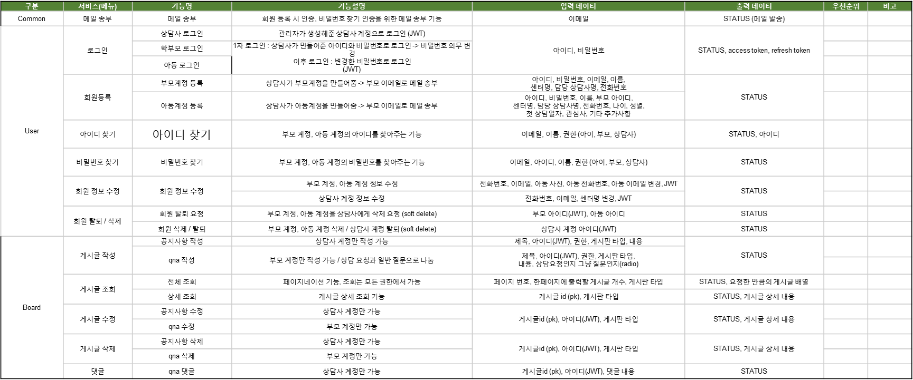

## 25.01.13

Jira 활용 Agile 방법론

## 1. 에픽(Epic)

- **개념**: 큰 단위의 요구사항이나 목표를 포괄하는 상위 레벨 작업. 여러 개의 스토리를 포함.

## 2. 스토리(Story)

- **개념**: 사용자 혹은 고객의 요구사항을 사용자 관점에서 설명한 작업 단위. 에픽을 구체화한 형태.

## 3. 태스크(Task)

- **개념**: 스토리를 달성하기 위해 필요한 구체적인 작업을 정의. 반드시 스토리에서만 생성해야 하는 것은 아니며, 독립적으로 작업 단위를 정의할 수도 있음.

## 4. 서브태스크(Sub-task)

- **개념**: 스토리 또는 태스크가 너무 커서 더 작은 작업 단위로 쪼개야 할 경우 사용하는 하위 작업 단위.

## 5. 스프린트(Sprint) 관리 (Scrum 기반)

애자일 방법론 중 **스크럼(Scrum)** 프로세스를 예로 들면, 일반적으로 다음과 같은 단계를 거칩니다.

1. **백로그(Backlog) 구성**

   - 모든 에픽, 스토리, 태스크를 제품 백로그(Product Backlog)에 우선순위별로 정리
   - 각 작업의 우선순위, 예상 소요 시간(스토리 포인트) 등을 함께 기록

2. **스프린트 계획(Sprint Planning)**

   - 백로그 중에서 이번 스프린트에서 처리할 작업(스토리, 태스크)을 선택
   - 작업을 진행할 팀원 지정, 예상 소요 시간 및 목표 설정
   - Jira에서 **Backlog** 화면에서 처리할 이슈들을 드래그 앤 드롭하여 새 스프린트에 담은 뒤 **Start Sprint**로 스프린트 시작

3. **데일리 스크럼(Daily Scrum)**

   - 매일 15분 정도 짧게 진행하는 스탠드업 미팅
   - Jira 보드(칸반/스크럼보드)를 활용해 진행 상황, 장애 사항 등을 빠르게 공유

4. **작업 진행(Working & Tracking)**

   - 팀원들은 스토리나 태스크를 In Progress(진행 중), Done(완료) 등의 칸반 컬럼으로 옮기며 상태를 업데이트
   - Jira에서 **Burndown Chart**, **Velocity Chart** 등을 통해 작업 진척도 및 속도를 파악

5. **스프린트 리뷰(Sprint Review)**

   - 스프린트가 끝나면 산출된 결과물을 리뷰하고, 고객 및 이해관계자에게 피드백 받음
   - Jira의 스토리/태스크 완료 상태, 스프린트 통계 등을 확인

6. **스프린트 회고(Sprint Retrospective)**
   - 스프린트 과정에서 잘 된 점, 개선할 점 등을 팀 내부에서 공유
   - 향후 더 효율적인 작업 방식을 찾기 위한 논의와 액션 아이템을 도출

---

## 25.01.14

ERD 작성현황 및 계획

## 1. ERD 작성 현황

- **MySQL**과 **MongoDB** 기반의 데이터베이스 테이블 구조 설계 완료
- **Primary Key** 설정 완료
- **외래 키(Foreign Key)** 및 MySQL과 MongoDB 간 연계는 현재 미완성 상태이며, 추후 추가적으로 완료 예정

## 2. MySQL 테이블 구성

- **유저(user)**, **공지사항(notice)**, **QnA(qna, qna_answer)**, **게임 진행(game_progress, game_result)**, **상담 일정(consultation_schedule)**, **미팅(meeting_session_info, meeting_participants)**, **파일(profile_image_file, board_file)** 등 다양한 테이블 구성 완료

## 3. MongoDB 테이블 구성

- **게시판 내용(board_content)**, **아동 정보(child_info)**, **채팅(chat, chat_bot)**, **게임 통계(pentagon_statistic, bar_statistic)** 등 주요 테이블 구성 완료

## 4. 게임 에셋 및 학습 에셋 관리 방안

- **MongoDB**에 포함된 `game_asset`과 `study_asset`의 관리 방식은 아직 미정
- 팀원들과의 추가 회의를 통해 **프론트엔드에서 관리할지**, **데이터베이스에 저장할지** 결정 예정

## 5. 향후 계획

- **외래 키(Foreign Key)** 추가 및 MySQL과 MongoDB 간의 데이터 연계 구축 예정
- 게임 및 학습 에셋 관리 방안 결정 후 반영 예정
- 현재까지의 ERD 작성 상황이며, 추가 사항은 팀원들과의 논의를 통해 반영 예정.
- 추가 회의 후 ERD 작성 완료 후 요구사항 명세서 작성 예정.

---

## 25.01.15

프로젝트 진행 요약

## 오늘의 작업 내용

### 1. **데이터베이스 설계 및 구축**

- MySQL Workbench를 활용하여 DB 스키마 및 테이블 생성
- 주요 테이블: `user`, `board`, `board_file`, `chatting_session_info`, `consultation_schedule`, `game_progress`, `game_result`, `game_schedule`, `game_video_file`, `meeting_session_info`, `meeting_participants`, `qna_answer`
- 테이블 간 외래 키(FK) 관계 설정 및 데이터 무결성 확보

### 2. **요구사항 명세서 작성**

- 서비스별 기능 및 설명 정리
- 입력 및 출력 데이터 정의
- 우선순위와 비고란 추가로 상세화

### 3. **추가 작업 계획 수립**

- 계정 삭제 요청 테이블 및 상담 요청 관련 테이블 추가 예정
- MongoDB 설계 진행 예정
- 요구사항 명세서 지속 작성 예정

---

---
